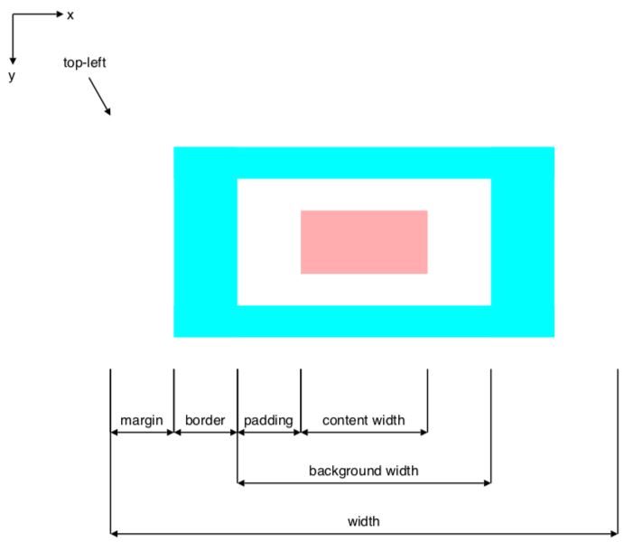

# Simple PDF Library

[](https://jitpack.io/#vkuzel/Simple-PDF-Layout)

A library which makes it easier to manually create a simple PDF document with [Apache PDFBox](https://pdfbox.apache.org).

## Features

* HTML-like element model.
* Reversed Y-axis so a point (0, 0) is at the top-left corner of the page.
* Basic elements for drawing boxes, texts, tables and arrows.

## Getting started

1. Include the library into your project.

    ```kotlin
    // build.gradle.kts
    repositories {
        maven("https://jitpack.io")
    }
    
    dependencies {
        implementation("com.github.vkuzel:Simple-PDF-Layout:2.1.2")
    }
    ```

2. Use it

    ```java
    // Create page of size A4.
    Page page = Page.a4()
            // Create a text box of width 100 points on the page and align it to right.
            .addText(text -> text
                    .setTopLeft(100, 100)
                    .setWidth(100)
                    .setAlignment(Text.Alignment.RIGHT)
                    .setText("Hello World!"))
            // Add an arrow pointing to the the previous element (text).
            .addArrow(arrow -> arrow
                    .setStartElement(arrow.getPrevious()));

    // Render text to file.
    Document.renderPageToFile(page, "some-path.pdf");
    ```

## Box model

Following image was rendered by `BoxModelDocumentTest.generateBoxModelDocumentTest()` method in this project.


